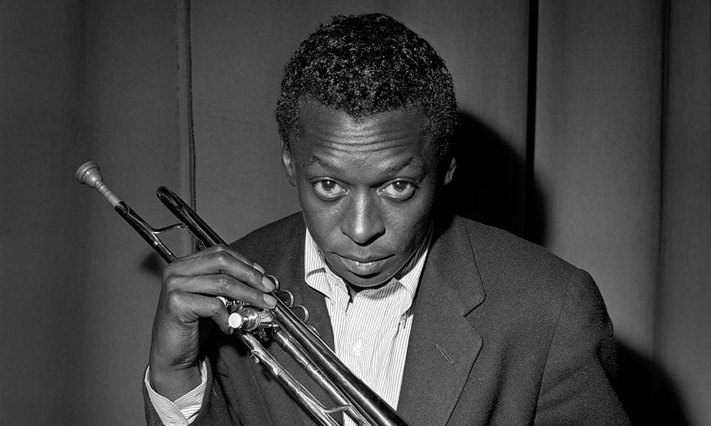
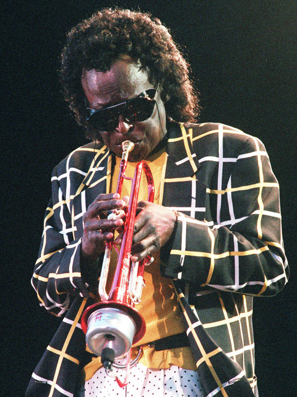

# Who was Miles?

[Mile Davis](https://en.wikipedia.org/wiki/Miles_Davis) was a cool dude. He was good at playing the trumpet and played jazz. Then later he played jazz-fusion because he is just that cool. I like his music and if you like his music, you should also listen to Herbie Hancock. 

# Songs by Him You Should Listen to If You Are Feeling Productive
### [Blue in Green](https://www.youtube.com/watch?v=PoPL7BExSQU)
### [Miles Ahead](https://www.youtube.com/watch?v=_GXE_XXty_c)
### [Stella by Starlight](https://www.youtube.com/watch?v=XGx1HvLV_NQ)

# His Fashion Style Changed With His Music Style

Look at his funny glasses!
